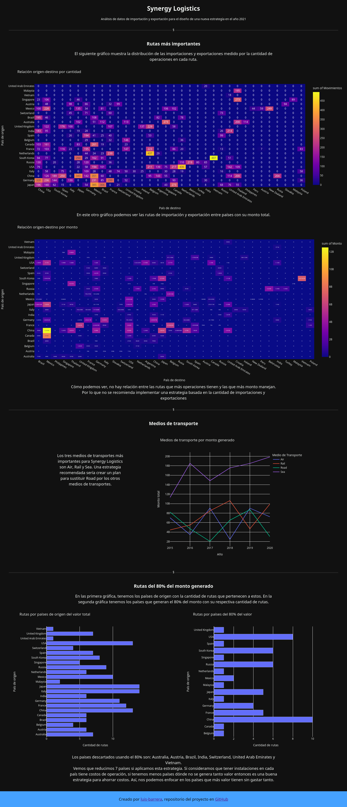

Proyecto en Dash
================

## Demo

[Live Demo en Heroku](https://powerful-eyrie-44090.herokuapp.com/)



## Demo local

Esta aplicación requiere de Python 3.

Para poder ejecutar la aplicación es necesario instalar las dependencias:

```shell
pip install -r requirements.txt
```

Luego, iniciamos la aplicación con:

```shell
pytohn app.py
```
